# 万字长文解析如何基于Redis实现消息队列

https://mp.weixin.qq.com/s?__biz=MzkxMjQzMjA0OQ==&mid=2247484622&idx=1&sn=e5199a4d0276a9aef8630ac9f781c48f

- 轻量化、运维部署成本低
- 基于 redis 实现的 mq 一定是存在消息丢失的风险的

## 0 前言

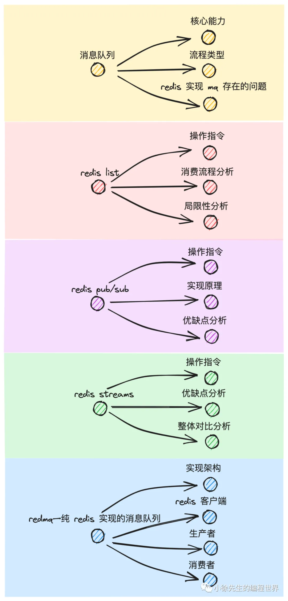

## 1 消息队列

`外卖暂存柜`

1. 一个合格的消息队列（MQ，message queue）应该具备哪些`核心能力`
   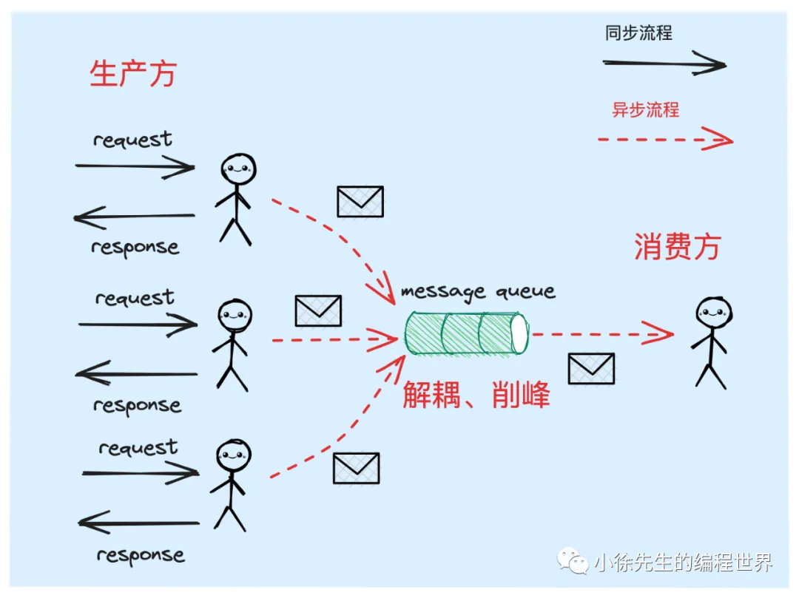

   - **解耦**：分离生产者和消费者的直接依赖，通过中间层缓冲消息；

   - **削峰**：应对突发流量，保护下游系统不被压垮(同步转异步，缓冲)

2. mq基础能力

- 消息不丢失
  从三个环节去看待这个问题：

  1. producer 将 msg 投递到 mq 时不出现丢失
  2. msg 存放在 mq 时不出现丢失
  3. consumer 从 mq 消费 msg 时不出现丢失

  保证1、3 => ACK 机制(做到 at least once的语义) + 幂等去重
  保证2 => 持久化机制(数据落盘+数据备份)

  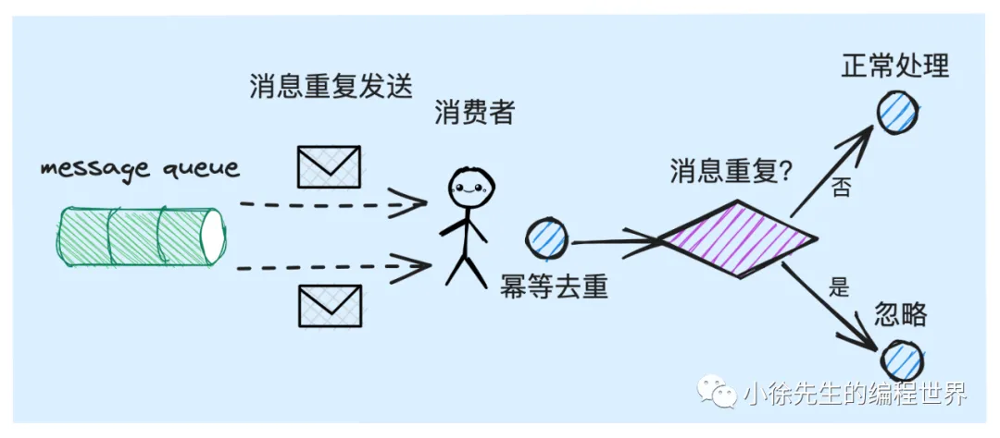

- 支持消息存储
  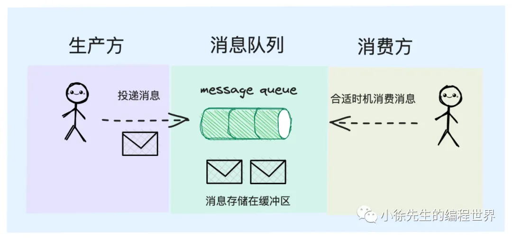
  消息能缓存在 mq 组件中一段时间，让消费方自由选择合适的时间过来进行消费.

3. 流程类型
   根据 consumer 消费的流程，将 mq 分为 push 型和 pull 型
   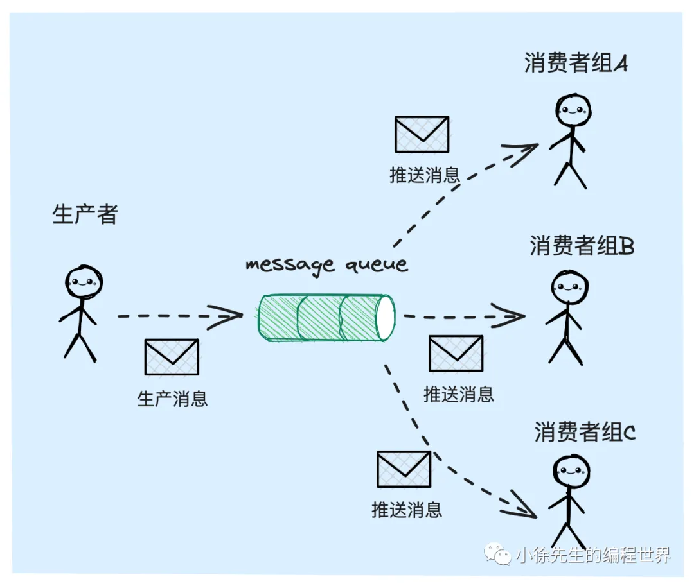
   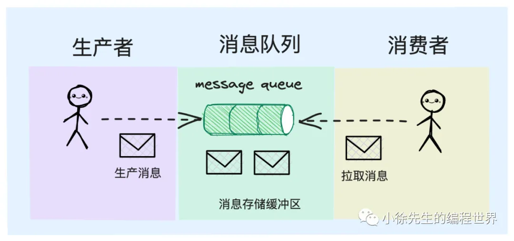
4. redis 实现 mq 的问题

- 存储昂贵
  redis 本身是基于内存实现的缓存组件，因此在存储消息时总容量相对有限.
- 数据丢失

  - 内存是易失性存储. 即便 redis 中有 rdb/aof 之类的持久化机制加以弥补，但这个持久化流程是异步执行的，无法提供百分百的保证力度
  - redis 走的是 ap 高可用流派，数据的主从复制流程是异步执行的，主从切换时数据存在弱一致问题

  `redis 存储消息时会不可避免地存在数据丢失的风险`

## 2 redis list

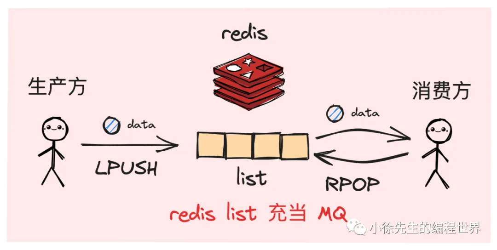

lpush + brpop(blocking rpop)

- 局限性分析
  1. 无法支持发布/订阅模式
     list 中的数据是独一份的，被 pop 出去后就不复存在了.
  2. 无法支持消费端 ack 机制
     brpop 获取到数据后，倘若发生宕机或者其他意外错误，没有一种有效的手段能给予 mq 一个消息处理失败的反馈.

## 3 redis pub/sub

- 局限性分析
  1. 缺乏 ack 机制
  2. 缺乏消息存储能力
     类似 golang 中的无缓冲型 channel
  3. 消息丢失问题
     - subscriber 宕机
     - redis 宕机
     - subscriber 消息积压

## 4 redis streams

从 redis 5.0 中，一个新的数据类型——streams 被推出了. 这种数据类型的目标正是直奔实现 mq 组件的功能而去的.

1. 操作指令
   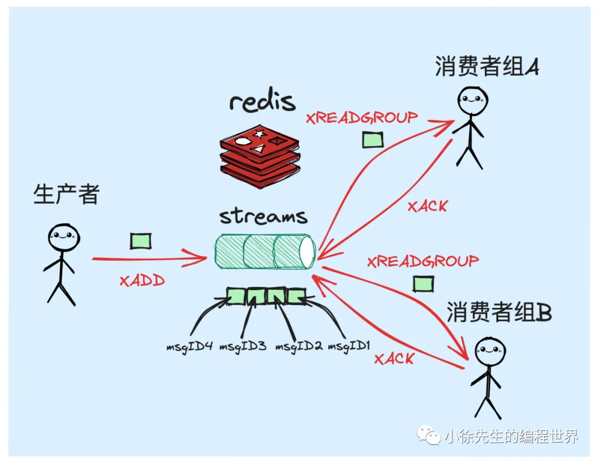

   - XADD 生产消息

   ```shell
   XADD my_streams_topic * key1 val1
   "1638515664470-0"
   XADD topic1 * key2 val2
   "1638515672769-0"
   ```

   `*`：消息自动生成唯一标识 id，基于`时间戳+自增序号`生成

   - XREAD/XREADGROUP 消费消息
     采用阻塞模式进行消费

   - XACK 确认消息
     通过 xack 指令，携带上消费者组、topic 名称以及消息 id，能够完成对某条消息的确认操作.

2. 优缺点分析

- 支持发布/订阅模式
  redis streams 引入了消费者组 group 的概念，因此是能够保证`各个消费者组 consumer group 均能够获取到一份独立而完整的消息数据.`
- 数据可持久化
  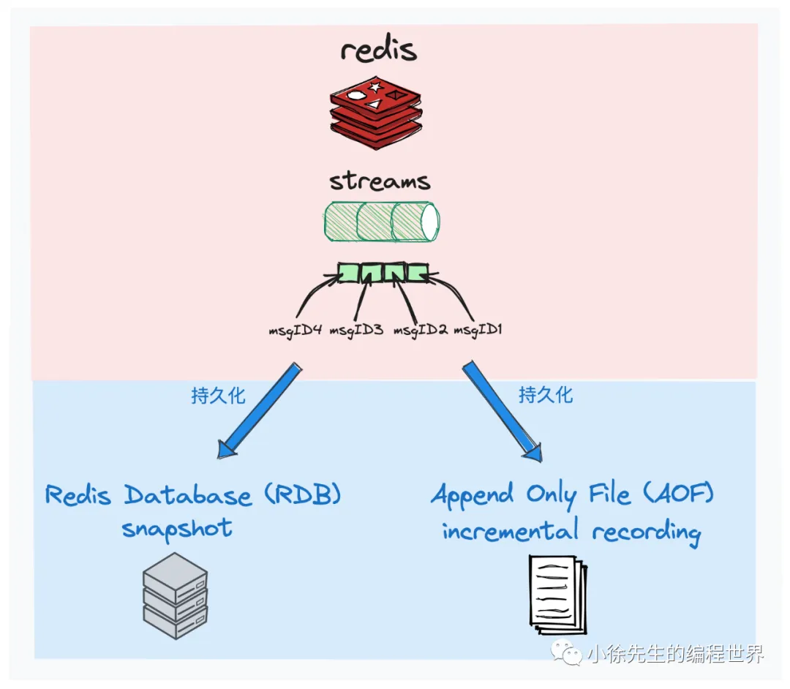
- 支持消费端 ack 机制
  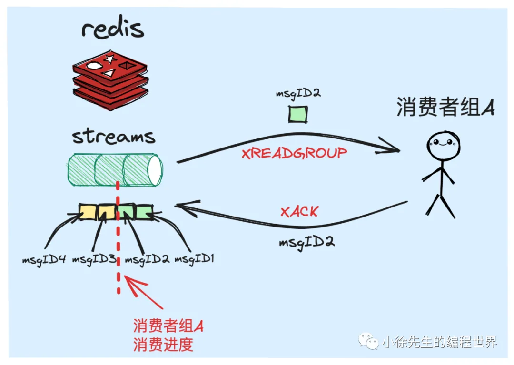
- 支持消息缓存
  和 pub/sub 模式不同的是，redis streams 中会实际开辟内存空间用于存储 streams 中的数据.
  redis streams 支持在每次投递消息时，显式设定一个 topic 中能缓存的数据长度，来人为限制这个缓存空间的容量.

3. 整体对比分析

## 5 redmq —— 一款 基于 redis 实现消息队列的客户端 sdk

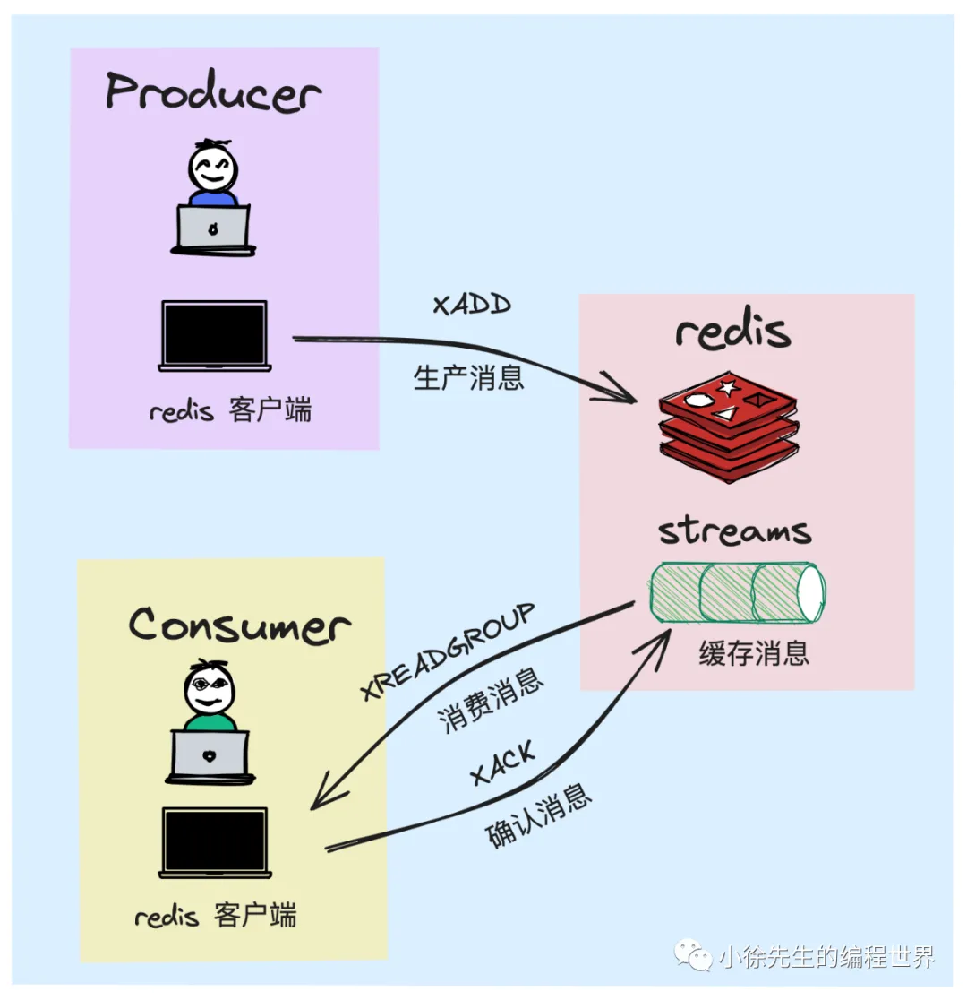
• redis client：封装了 redis streams 相关指令，包括 XADD、XREADGROUP、XACK
• producer：生产者，内置了 redis 客户端，通过 XADD 指令实现消息的生产投递
• consumer：消费者，内置了 redis 客户端，通过 XREADGROUP 指令实现消息的消费，通过 XACK 指令实现消息的确认

1. redis 客户端
2. 生产者
3. 消费者

- 消费新消息
- 投递失败次数超限的老消息进入死信
- 消费未确认老消息

```go

// 运行消费者
func (c *Consumer) run() {
  // 通过 for 循环实现自旋模型
	for {
		select {
		case <-c.ctx.Done():
			return
		default:
		}

		// 新消息接收处理
		msgs, err := c.receive()
		if err != nil {
			log.ErrorContextf(c.ctx, "receive msg failed, err: %v", err)
			continue
		}

    // 接收到新消息后，执行对应的 callback 回调方法
		tctx, _ := context.WithTimeout(c.ctx, c.opts.handleMsgsTimeout)
		c.handlerMsgs(tctx, msgs)

		// 死信队列投递
    // 当消息处理失败达到指定次数时，会被投递到此处
		tctx, _ = context.WithTimeout(c.ctx, c.opts.deadLetterDeliverTimeout)
		c.deliverDeadLetter(tctx)

		// pending 消息接收处理
    // 接收之前就已分配给当前 consumer，但是还未得到 xack 确认的老消息
		pendingMsgs, err := c.receivePending()
		if err != nil {
			log.ErrorContextf(c.ctx, "pending msg received failed, err: %v", err)
			continue
		}

    // 接收到老消息后，执行对应的 callback 回调方法
		tctx, _ = context.WithTimeout(c.ctx, c.opts.handleMsgsTimeout)
		c.handlerMsgs(tctx, pendingMsgs)
	}
}
```
